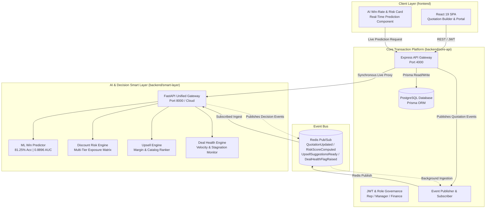

# DealFlow360 — Next-Gen B2B Quote-to-Cash with Smart Layer AI

[](https://github.com/Sahil073/Team149_odooHackathon2026)
[](frontend)
[](backend/core-api)
[](backend/smart-layer)
[](backend/smart-layer/train_win_predictor.py)
[](https://dealflow360-smart-layer.onrender.com)

DealFlow360 is an enterprise-grade B2B Quote-to-Cash and Revenue Operations platform built for the **Odoo Hackathon 2026**. It combines a transactional execution engine (PostgreSQL, Prisma, Node/Express) with an intelligent, non-blocking **AI Smart Layer** (Python FastAPI, ML Win Prediction, Discount Risk Scoring, Upsell Optimization, and Deal Velocity Health monitoring).

---

## System Architecture



---

## Directory Organization

The repository is structured as an industry-standard monorepo separating concerns into `frontend`, `backend`, and `docs`:

```text
Team149_odooHackathon2026/
├── frontend/                          # React 19 + TypeScript + Vite + Tailwind CSS
│   ├── src/
│   │   ├── components/                # Modular UI widgets (DealWinRateCard, Metrics, Modals)
│   │   ├── pages/                     # QuotationBuilder, ApprovalDashboard, CustomerPortal
│   │   ├── services/                  # Backend API client and live data transformers
│   │   └── types/                     # TypeScript domain models
│   ├── package.json
│   └── vite.config.js
│
├── backend/                           # All backend runtime services
│   ├── core-api/                      # Node.js + Express + Prisma + PostgreSQL + Redis
│   │   ├── src/
│   │   │   ├── routes/                # REST API endpoints (quotes, approvals, AI proxy)
│   │   │   ├── services/              # Core business logic & database operations
│   │   │   ├── events/                # Redis Pub/Sub publisher & subscriber
│   │   │   └── database/              # Prisma schema, migrations, and seed data
│   │   ├── .env.example
│   │   ├── package.json
│   │   └── tsconfig.json
│   │
│   └── smart-layer/                   # Python FastAPI AI & Decision Intelligence Engine
│       ├── gateway.py                 # Unified HTTP API Gateway & REST endpoints
│       ├── train_win_predictor.py     # ML training pipeline for Deal Win-Rate Predictor
│       ├── deal_win_weights.json      # Production model weights & scalers
│       ├── requirements.txt           # Python dependencies (pinned with numpy)
│       ├── .python-version            # Pinned to Python 3.11.9
│       ├── risk-engine/               # Multi-rule discount exposure & margin analysis
│       ├── upsell-engine/             # Margin-optimized product recommendation engine
│       ├── deal-health/               # Deal stagnation, discount anomaly, and velocity checks
│       └── shared/                    # Shared Redis client and fail-safe resilience logic
│
├── docs/                              # Project Documentation & Architecture
│   ├── DealFlow360_Project_Report.md  # Comprehensive evaluator report & scoring guide
│   ├── architecture.md                # System design & cross-service communication
│   ├── api-reference.md               # Complete REST API & Pub/Sub contract reference
│   ├── setup-guide.md                 # Local and Cloud setup guide
│   └── specifications/                # ICD & Execution Plan PDFs
│
├── .gitignore                         # Monorepo gitignore
├── package.json                       # Root monorepo scripts
├── render.yaml                        # Infrastructure-as-code for Render deployment
└── README.md                          # Main project documentation
```

---

## 4 Intelligent Pillars of the Smart Layer

| Feature | Engine | Algorithm / Mechanism | Business Impact |
| :--- | :--- | :--- | :--- |
| **1. Deal Win Probability** | `train_win_predictor.py` | L2-Regularized Logistic Regression (vectorized gradient descent, 81.25% test accuracy, 0.8896 ROC-AUC) | Real-time close rate estimation with explainable key drivers and optimal discount recommendations. |
| **2. Discount Risk Scoring** | `risk-engine/` | Weighted Category Margin Matrix + Max Exposure Thresholds | Automatically triggers multi-tier approvals (Sales Manager $>15\%$, VP Finance $>25\%$). |
| **3. Upsell & Add-on Engine** | `upsell-engine/` | Margin-Delta $\times$ Affinity Frequency Ranking | Suggests high-margin add-ons and warranty packages directly in the quote builder. |
| **4. Deal Health Monitoring** | `deal-health/` | Anomaly Z-Score Analysis + Temporal Stagnation Sweeper | Alerts reps and managers to stalled quotes before revenue slips past quarter-end. |

---

## Quick Start Guide

### 1. Prerequisites
- **Node.js**: v20+
- **Python**: v3.11.x
- **PostgreSQL** & **Redis**

### 2. Setup & Installation

```bash
# Clone the repository
git clone https://github.com/Sahil073/Team149_odooHackathon2026.git
cd Team149_odooHackathon2026

# Install Frontend dependencies
cd frontend && npm install && cd ..

# Install Core API dependencies & seed database
cd backend/core-api
npm install
npm run db:push
npm run seed
cd ../..

# Install Smart Layer dependencies & train ML model
cd backend/smart-layer
pip install -r requirements.txt
python train_win_predictor.py
cd ../..
```

### 3. Running Locally

Using monorepo commands from the root directory:

```bash
# Terminal 1: Core API Server (Port 4000)
npm run dev:backend

# Terminal 2: AI Smart Layer Gateway (Port 8000)
npm run dev:smart-layer

# Terminal 3: React Frontend (Port 5000 / 5173)
npm run dev:frontend
```

---

## Cloud Hosting (Render)

The application is deployed across Render cloud services:

| Component | Service Name | Runtime | Root Directory | Status |
| :--- | :--- | :--- | :--- | :--- |
| **Core API** | `dealflow360-backend` | Node 20 | `backend/core-api` | Live |
| **Smart Layer** | `dealflow360-smart-layer` | Python 3.11.9 | `backend/smart-layer` | [Live URL](https://dealflow360-smart-layer.onrender.com) |
| **Database** | `dealflow360-db` | PostgreSQL 16 | — | Live |
