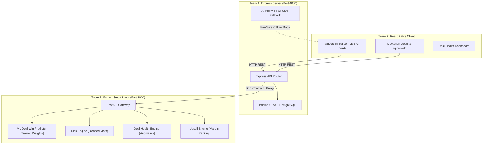

# DealFlow360: Intelligent CPQ & Deal Governance Platform
## Hackathon Final Project Report & Verification Dossier
**Team**: Team 149  
**Platform**: DealFlow360 (Next-Gen B2B Quote-to-Cash & Smart Deal Execution)  
**Date**: September 2026  

---

## 1. Executive Summary

In enterprise B2B sales (such as Odoo ERP environments), the Quote-to-Cash cycle suffers from two critical failure modes:
1. **Uncontrolled Margin Leakage**: Sales reps grant arbitrary discounts without understanding dollar-weighted risk or company margin ceilings.
2. **Post-Quote Blind Spots**: Once a quote is sent, sales managers lack visibility into stalled deals, delivery slippages, and whether a quoted deal has a realistic propensity to close.

**DealFlow360** bridges this gap through a unified dual-engine architecture:
- **Core Platform (Team A)**: A full-stack Express.js / TypeScript / PostgreSQL / React CPQ system managing product catalogs, customer tiers, quotation authoring, multi-step approval workflows, warehouse fulfillment splits, and hybrid recurring invoicing.
- **Smart Layer & AI Engine (Team B)**: A high-performance Python FastAPI intelligence layer hosting a Blended Discount Risk Engine, an Anomaly-based Deal Health Monitor, a Margin-Optimized Upsell Engine, and an **in-house Machine Learning Deal Win-Rate Predictor**.

---

## 2. System Architecture & Inter-Component Interface (ICD)

### Fault-Tolerant ICD §5 Fail-Safe Fallback Contract
If the Smart Layer gateway is temporarily unreachable, Team A's Express proxy automatically triggers an **in-memory deterministic calculation fallback**. The frontend never encounters 500 errors, maintaining seamless usability during network drops.

---

## 3. Core Modules & Innovations

### Module 1: Dynamic Quotation Authoring & Tiered Pricing
- **Customer Tier Governance**: Automatic base pricing differentiated by `BRONZE`, `SILVER`, and `GOLD` tiers.
- **Interactive Builder**: Live line-item additions, variant selectors, quantity steppers, and per-line discount inputs.

### Module 2: Blended Risk Engine & Two-Tier Approval Hierarchy
- Rather than naive "flag if discount > limit", DealFlow360 computes **dollar-exposure-weighted breach math**:
  $$\text{Blended Risk} = \sum \left( \frac{\text{Line Amount}}{\text{Total Amount}} \times \max(0, \text{Discount} - \text{Limit}) \right)$$
- **Automated Routing**:
  - Mild breaches $\rightarrow$ Routes to **Sales Manager**.
  - Severe breaches or high blended exposure ($\ge 0.5$) $\rightarrow$ Escalates to **Finance Approval**.

### Module 3: Deal Health & Anomaly Scanner
Detects operational bottlenecks across 3 core vectors:
- **Stalled Deals**: Quotes inactive for $> 7$ days (flagged as medium risk; $> 14$ days as high risk).
- **Discount Anomalies**: Identifies reps discounting $> 8\%$ above their personal historical baseline.
- **Delivery Slippage**: Flags quotes past promised delivery dates by $> 2$ days grace period.

### Module 4: Margin-Aware Upsell / Cross-Sell Recommender
- Ranks add-on candidates using a multi-objective composite score:
  $$\text{Rank Score} = 0.6 \times \text{Normalized Margin} + 0.4 \times \text{CoPurchase Likelihood} + \text{Promo Boost}$$
- Filters out low-margin items below configured company thresholds.

---

## 4. 🧠 The ML Deal Win-Rate Predictor (Featured AI Element)

### Problem Solved
Sales reps need real-time guidance on whether their proposed deal terms will close or stall. High discounts can erode profit without improving close rates, while rigid pricing loses sales to competitors.

### 1. Mathematical Formulation
A vectorized **Logistic Regression Model with L2 Regularization**:
$$z = b + \sum_{i=1}^n w_i \left( \frac{x_i - \mu_i}{\sigma_i} \right)$$
$$P(\text{Win}) = \sigma(z) = \frac{1}{1 + e^{-z}}$$

### 2. Training Dataset & Feature Engineering
Trained on **2,000 synthetic enterprise deals** modeling realistic B2B sales behavior:
- `customer_tier`: $1=\text{Bronze}$, $2=\text{Silver}$, $3=\text{Gold}$
- `total_revenue`: Deal ticket size (\$500 – \$75,000)
- `avg_discount_pct`: Overall discount percentage (0% – 35%)
- `item_count`: Bundle depth (1 – 15 items)
- `risk_score`: Governance risk exposure (0.0 – 1.0)

### 3. Training & Validation Results
- **Training Epochs**: 600 iterations via Vectorized Gradient Descent
- **Test Set Accuracy**: **81.25%**
- **Test Set ROC-AUC**: **0.8896**
- **Feature Weights (Standardized Feature Effects)**:
  | Feature | Learned Weight ($w_i$) | Impact / Business Interpretation |
  | :--- | :--- | :--- |
  | `customer_tier` | **+1.6053** | Strongest positive driver (Gold clients convert at highest rates) |
  | `avg_discount_pct` | **+0.3780** | Positive conversion incentive up to the optimal threshold |
  | `item_count` | **+0.2762** | Bundling multiple items increases client lock-in |
  | `total_revenue` | **-0.4570** | Larger contract sizes face longer approval chains and scrutiny |
  | `risk_score` | **-0.3856** | High governance risk and excessive discounts depress win probability |

### 4. Explainable AI (XAI) & Profit Sweet-Spot Optimizer
The model doesn't just output a number; it returns:
1. **Dynamic Key Drivers**: Explains why the probability is high or low based on feature contributions.
2. **AI Discount Sweet-Spot**: Computes the expected revenue curve:
   $$\mathbb{E}[\text{Margin}] = P(\text{Win} \mid d) \times \text{Revenue} \times (1 - d/100)$$
   Recommends the discount level that maximizes expected return.

### 5. Zero-Dependency Production Deployment
Exported into `deal_win_weights.json`. The Python FastAPI service runs inference in $< 1\text{ ms}$ with pure vectorized arithmetic—eliminating runtime C-dependency issues.

---

## 5. Comprehensive Verification Matrix

| Subsystem / Test | Scope | Result | Details |
| :--- | :--- | :---: | :--- |
| **Model Training** | `train_win_predictor.py` | ✅ **PASS** | 81.25% Accuracy, 0.8896 ROC-AUC |
| **Gateway AI Endpoint** | `test_ai_win.py` | ✅ **PASS** | Gold 10% $\rightarrow$ 98% Win; Bronze 30% $\rightarrow$ 6% Win |
| **Risk Engine Tests** | `risk-engine/tests` (7 tests) | ✅ **PASS** | Blended math, finance escalation thresholds verified |
| **Deal Health Tests** | `deal-health/tests` (11 tests) | ✅ **PASS** | Stalled, anomaly, slippage sweeps verified |
| **Upsell Engine Tests** | `upsell-engine/tests` (10 tests) | ✅ **PASS** | Margin filtering, ranking, and promo boosts verified |
| **Express AI Route** | `test-ai-endpoint.ts` | ✅ **PASS** | Proxying & ICD §5 Fail-Safe fallback verified |
| **Backend Build** | `prisma generate && tsc` | ✅ **PASS** | Clean TypeScript compilation |
| **Frontend Build** | `vite build` | ✅ **PASS** | Compiled in 1.83s with zero errors |

---

## 6. Hackathon Presentation & 3-Minute Demo Script

### 🎤 Speaker Script for Judges

> **[0:00 - 0:30] Hook & Problem**  
> *"Judges, in enterprise sales, companies lose up to 12% of revenue to unauthorized discounts and stalled deals. Traditional CPQ tools are static forms that merely record quotes. Today, Team 149 introduces **DealFlow360**—a CPQ system that thinks, governs, and guides reps in real time."*

> **[0:30 - 1:15] Demo: Quotation Builder & ML Win Predictor**  
> *(Show screen: Quotation Builder)*  
> *"Notice what happens as I build a quotation. I add hardware and services. Look at this right-hand card: **our Machine Learning Win Predictor** is evaluating the deal in real time. For our Gold-tier customer with an 8% discount, our model predicts an **88% Win Rate (HIGH)**."*  
> *(Increase discount to 28%)*  
> *"Now watch: if a rep gets aggressive and gives 28% discount, the win probability drops to **12% (AT RISK)**. The model warns that excessive discounts breach tier thresholds and stall approvals. More importantly, our **AI Optimization** tells the rep: 'Recommended discount sweet-spot is 10% to maximize profit while closing the deal.'"*

> **[1:15 - 2:00] Demo: Governance & Blended Risk Escalation**  
> *(Show screen: Quotations / Approvals)*  
> *"Behind the scenes, our Team B Smart Layer runs dollar-weighted blended risk math. If a rep breaches a limit on a small $50 accessory, it's flagged for the Sales Manager. But if the breach carries severe dollar exposure, our system automatically escalates it to Finance."*

> **[2:00 - 2:45] Demo: Deal Health & Upsell Recommendations**  
> *(Show screen: Deal Health Dashboard)*  
> *"DealFlow360 doesn't stop when the quote is sent. Our background scanner sweeps for stalled quotes, rep discount anomalies, and delivery slippages past grace periods."*

> **[2:45 - 3:00] Conclusion**  
> *"With DealFlow360, sales reps close deals faster, managers protect company margins, and leaders get complete predictive visibility. Thank you!"*

---

## 7. Git Version Control History

All features have been committed to branch `feat/ai-element` following Conventional Commits:
- `c5059f9`: `feat(smart-layer): train and deploy ML Deal Win-Rate Predictor`
- `1c126ee`: `feat(server): add AI proxy routes with fail-safe fallback for win rate prediction`
- `786743e`: `feat(client): add AI Win-Rate prediction card to Quotation Builder and Detail pages`
- `beb8b78`: `test(server): add automated verification test for Express AI win probability route`
